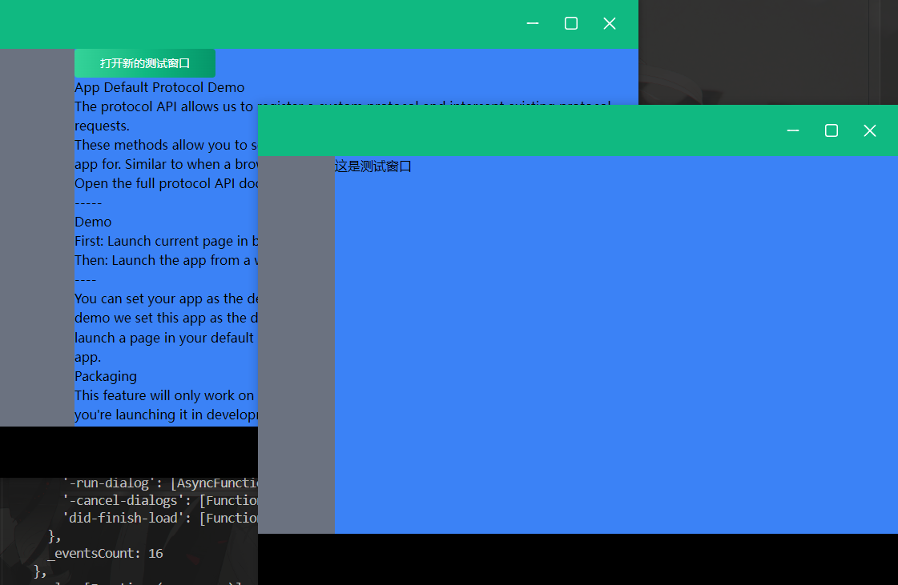

# <center>Vue 3 + Vite + Electron + Tailwind CSS + Flowbite + Pinia + Vue Router</center>

### 项目介绍

1.这是一个基于 Vue 3 + Vite + Electron + Tailwind CSS + Flowbite + Pinia + Vue Router 的项目基础模板。

2.electron 新增托盘操作、多窗口创建及多窗口的移动、缩小、隐藏、放大、关闭、应用退出操作。

<p align="center">



</p>
### 运行项目

1. clone 项目

```bash
git clone https://github.com/Juenfy/vite-electron-vue3.git
```

2. 进入项目目录

```bash
cd vite-electron-vue3
```

3. 安装依赖

```bash
npm install
```

4. 运行项目

```bash
npm run dev
```
